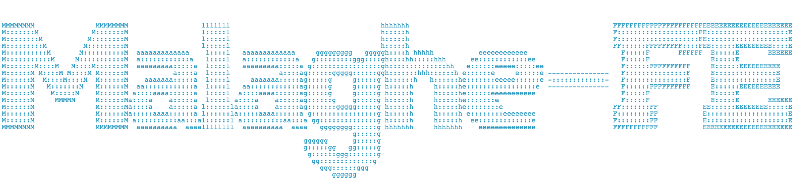

# **Malaghe™ - FrontEnd**

---

 

## **Description** :

## FrontEnd of Malaghe™ Project. Developed using Next.js, React.js, TailwindCss, Docker, nginx (reverse proxy).

## More docs are available on malaghe-be.

 

---

## **Links**:

## Backend github: --> https://github.com/apakhbari/Malaghe-BE

## docker --> https://hub.docker.com/repository/docker/apakhbari/malaghe

---

## **TODO**:

1- Make it responsive

### **temp ToDo:**

---

 

# **© APA, 2022-2023, all rights reserved**

